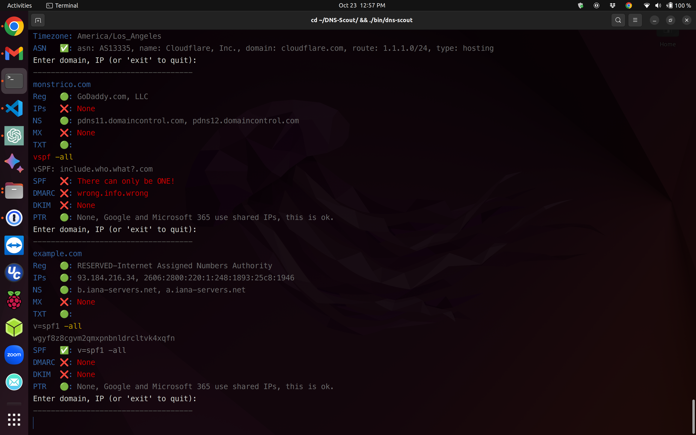
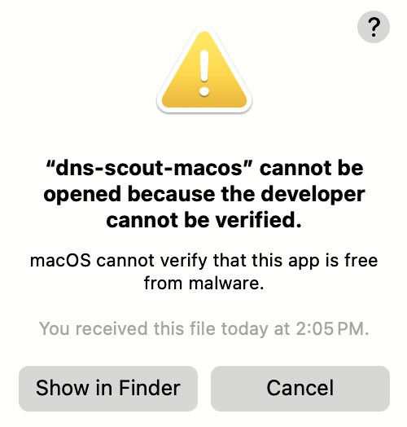

[](https://codeclimate.com/github/careyjames/DNS-Scout/test_coverage)

[](https://codeclimate.com/github/careyjames/DNS-Scout)
[](https://goreportcard.com/report/github.com/careyjames/DNS-Scout)
[](https://www.linux.org/ "Go to Linux homepage")
[](https://www.apple.com/macos/ "Go to Apple homepage")


[español](https://github.com/careyjames/DNS-Scout/blob/main/README(espa%C3%B1ol).md)

DNS Scout is a DNS troubleshooting tool that gets your email to the inbox. Checks SPF, DMARC, DKIM and MX records, for InfoSec Pros and Normies. Compatible with macOS, Ubuntu, Raspberry Pi and Kali Linux.




## Features

**Curated Output for Clarity:**
DNS Scout stands out by filtering out non-essential information,
presenting users with a cleaner, more focused view of the DNS data,
and optimizing for clarity and relevance.

**Enhanced Interactive CLI Interface:**
DNS Scout leverages `readline` to offer an advanced command-line interface
that's **easy to see and copy/paste**

**Session-based Memory Cycling**
DNS Scout's interactive interface has a memory cycle feature,
controlled by the up and down arrow keys. It helps navigate recent
lookups for the session quickly.
This feature is useful when conducting multiple lookups,
and you need to refer to a previous entry.

**Streamlined WHOIS Lookup:**
DNS Scout efficiently parses domain registration data,
presenting the user with concise registrar details and name servers,
eliminating the clutter typically seen in raw WHOIS outputs.

**Clear TXT Record Display:**
DNS Scout lists TXT records in an easily digestible format,
making tasks like SPF or DMARC verification review more straightforward.

**Registrar**  
**NS Name Servers**  
**MX Records**  
**Displays TXT Records**, useful for checking domain verification,
SPF settings, etc.  
**DMARC Records**  
**DKIM** google default and 365 defaults present, just enter domain.com  
**PTR**  
**ASN**  
**Exact DNS data, no scrolling**  

### Installation Guide for DNS Scout

#### Manual MacOS, Kali, Ubuntu Linux Nerd Install

Prerequisites: Go 1.21

1. **Download the Binary to your home folder:**
   Download and **extract** the compiled binary for your operating system from
   the [Releases](https://github.com/careyjames/dns-scout/releases) page.

2. **Make It Executable:**
   After downloading, open terminal and run:  
   a. ```cd ~/Downloads/<unzipped-folder-name>``` "unzipped-folder-name"
   is the name of the folder created when extracting the tar file.  
   b. ```sudo chmod +x dns-scout```

3. **Move to PATH:**
   Move the executable to a directory in your system's PATH.  
   For example, you can move it to /usr/local/bin/ on a Unix-based system:  
   a. ```sudo mkdir -p /usr/local/bin/```  
   b. ```sudo mv dns-scout /usr/local/bin/```

4. **Get free or paid token (for ASN) from ipinfo.io**
   [Website](https://ipinfo.io) and run the "setup-api-token.sh".  
   a. ```cd ~/Downloads/<unzipped-folder-name>``` "unzipped-folder-name"
   is the name of the folder created when extracting the tar file.  
   b. ```sudo chmod +x setup-api-token.sh```  
   c. ```./setup-api-token.sh```  
   d. if you downloaded the **.deb for Linux** the setup-api-token.sh is in /usr/share/doc/dns-scout/  
   
5. **Run DNS Scout:**
   Open a **new** terminal window and type `dns-scout` to launch the tool.  
   Enter "your-domain.com" or a raw IP address like "1.1.1.1" to get started.  
   No need to enter "https://" or subdomains like "www" unless you are looking for specific custom records or DKIM selectors for example, so you would enter mycustomemailselector._domainkey.yourdomain.com  

   **For MacOS users,** go to System Settings > Security & Privacy and
   give `dns-scout` permissions.  
   **If you have never used macOS terminal** and the colors
   are default "Basic" Terminal>Settings>Profiles and choose "Homebrew",
   at least until you discover [oh my zsh.](https://github.com/ohmyzsh/ohmyzsh)

     
   If you see a popup when you launch DNS Scout, click "**Allow**" or "**Open**".  

That's it! You've manually installed DNS-Scout.

Check out [this article](https://www.machelpnashville.com/dns-security-with-dmarc-and-spf-a-comprehensive-guide-to-stop-hackers/) to learn more about email deliverability and DMARC.  

**Here's a breakdown of how each method of storing the API token could be useful:**

Environment Variable: Useful for users running the program in a controlled
environment like a server,
where setting environment variables is common practice.
The ```/setup-api-token.sh``` script would be helpful for them.

Command-Line Argument: Useful for those who wish to specify different API tokens
for different runs without changing environment variables.
It could be useful for testing.
